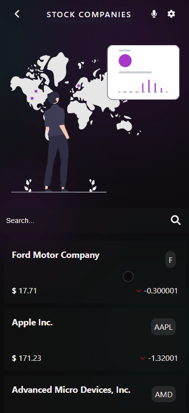

# Stocks

> It is an app built using React&Redux and [Financial modeling prep API](https://site.financialmodelingprep.com/developer/docs)! You can see data and metrics from companies' stocks and search for a certain company!

  

## Built With

- HTML, CSS
- SASS
- React
- Font Awesome
- [Financial modeling prep API](https://site.financialmodelingprep.com/developer/docs)
- SVG illustrations from [unDraw](https://undraw.co/)

## Live Demo

- [Click here to see a live version on Netlify!](https://peaceful-elion-dffb9b.netlify.app)

## Video presentation

- 

## Getting Started

To get a local copy up and running follow these steps:

1. Click the green button "Clone" and choose a preferable way of cloning.
2. Clone the project to your local machine.
3. Open the project folder in your favorite IDE (Preferably Visual Studio Code).
4. Click "View" and choose "Terminal" in the dropdown menu.
5. Enter `npm i` in the terminal to install all dependencies.
6. Enter `npm start` in the terminal to run the project on your local server.

## Author

- GitHub: [@rdnrn](https://github.com/rdnrn)
- LinkedIn: [Nana Rodina](https://www.linkedin.com/in/arina-rodina-144612219/?locale=en_US)
- Twitter: [nana](https://twitter.com/rdnrn_nana)

## Available Scripts

In the project directory, you can run:

### `npm start`

Runs the app in the development mode.\
Open [http://localhost:3000](http://localhost:3000) to view it in your browser.

The page will reload when you make changes.\
You may also see any lint errors in the console.

### `npm test`

Launches the test runner in the interactive watch mode.\
See the section about [running tests](https://facebook.github.io/create-react-app/docs/running-tests) for more information.

### `npm run build`

Builds the app for production to the `build` folder.\
It correctly bundles React in production mode and optimizes the build for the best performance.

The build is minified and the filenames include the hashes.\
Your app is ready to be deployed!

See the section about [deployment](https://facebook.github.io/create-react-app/docs/deployment) for more information.

## 🤝 Contributing

Contributions, issues, and feature requests are welcome!

[You can leave them here!](https://github.com/rdnrn/react-redux-capstone/issues)

## Show your support

Give a ⭐️ if you like this project!
